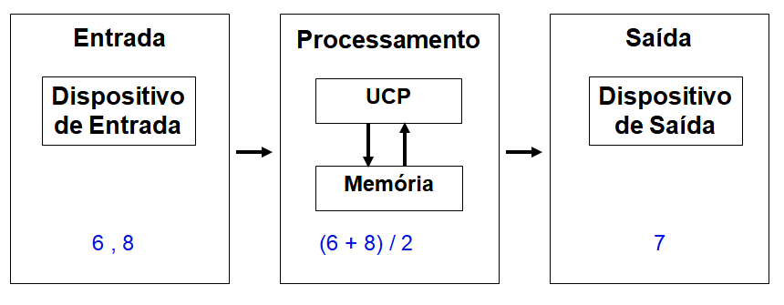
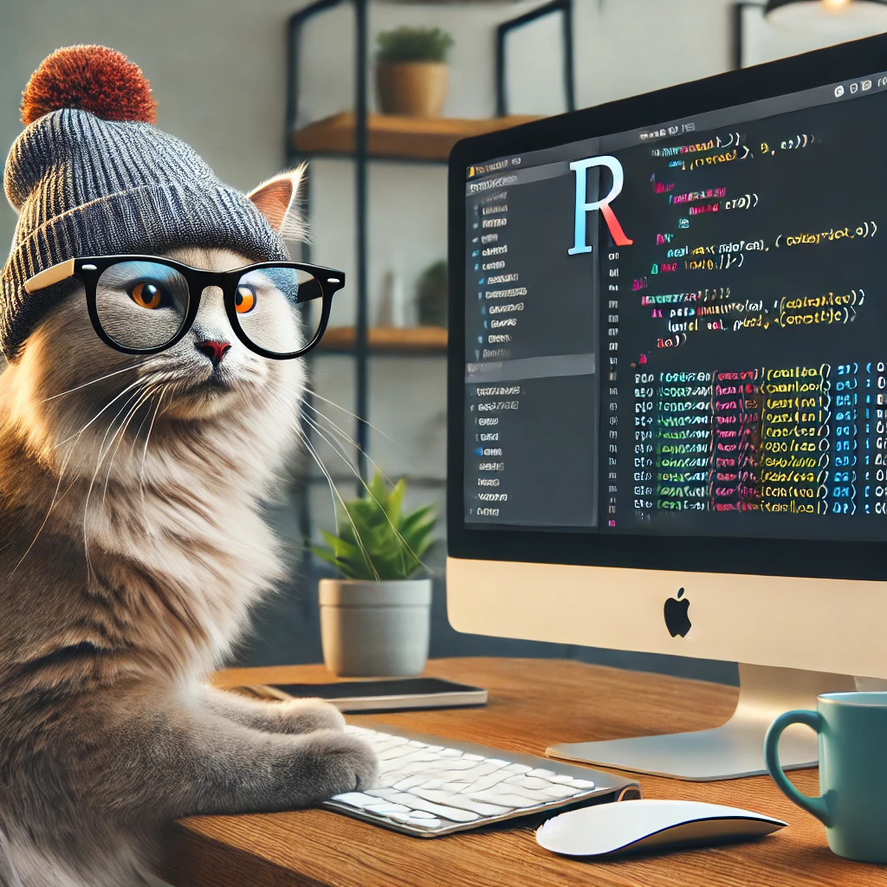
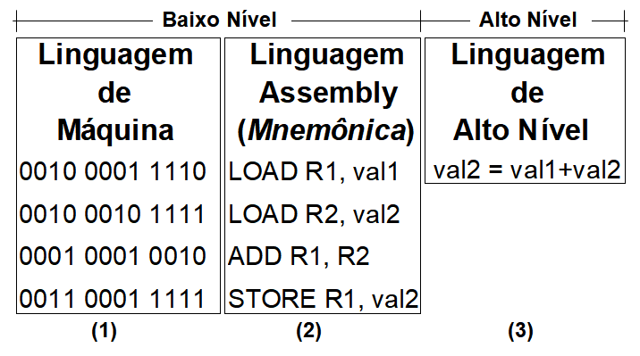
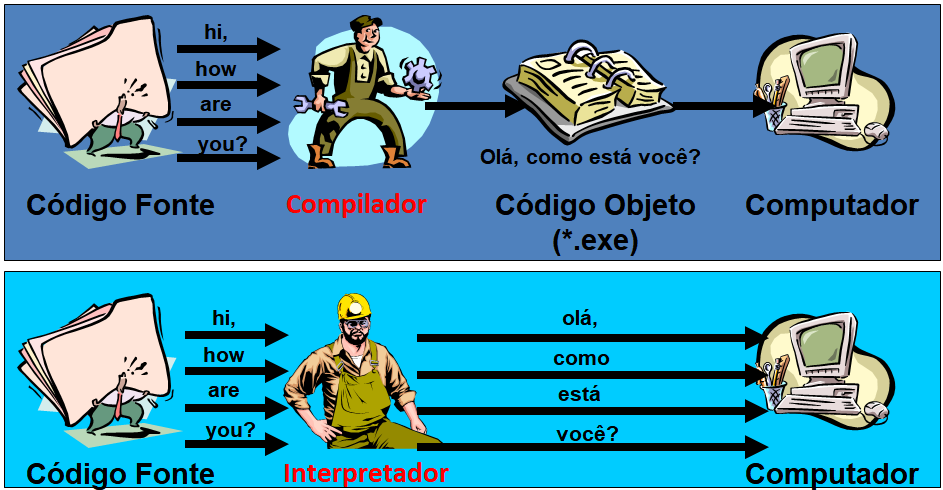

### Introdução

A Lógica pode ser definida como a **análise das formas e leis do pensamento**, mas não se preocupa com a produção do pensamento, não se preocupa com o conteúdo do pensamento, mas sim com a **maneira pela qual os pensamentos são organizados e apresentados**, possibilitando que cheguemos a uma conclusão por meio do encadeamento dos argumentos.

>A lógica é a ciência que estuda as leis do raciocínio. Correção/validação do pensamento.
Encadeamento/ordem de ideias. Arte de bem pensar.

---

### Conceitos básicos

Em *Lógica* um conceito importante é o de **"Proposição"**.

**Proposição:** é um enunciado verbal, ao qual deve ser atribuído, sem ambiguidade, um valor lógico verdadeiro ($V$ ou $TRUE$) ou falso ($F$ ou $FALSE$). 

**Abstração:** Operação mental que observa a realidade e captura apenas os aspectos relevantes para um contexto.


```{r echo=FALSE, fig.cap="Passe alguns segundos olhando para a figura abaixo e diga o que você consegue abstrair dela.",fig.align='center',out.width = "200px"}

```

---


```{r echo=FALSE, fig.cap="Passe alguns segundos olhando para a figura abaixo e diga o que você consegue abstrair dela.",fig.align='center',out.width = "200px"}

```


Perceba que a realidade é a mesma, isto é, uma figura em preto e branco, mas, dependendo da observação da realidade, você pode ter abstrações diferentes. Por isso, a abstração depende mais do observador do que da realidade observada.

> A tarefa de programar sistemas computacionais envolve o exercício constante da abstração da realidade e sua codificação em uma linguagem de programação.


---

### Programação de computadores

**Programação:** A tarefa de programar sistemas computacionais e envolve o exercício constante da abstração da realidade e sua codificação em uma linguagem de programação.

```{r echo=FALSE, fig.cap="Exemplo de programação de um sistema para exibir a média de dois números",fig.align='center',out.width = "700px"}

```


---

Exemplo para o R.

```{r}
#Entrada
a<-6
b<-8

#Processamento
resultado <- (a+b)/2

#Saída
resultado
```

---

### Linguagem de Programação

**Linguagem de Programação:** conjunto de palavras e regras que permitem comunicar ao computador o que este deve executar.

Em computação, uma linguagem de programação é a ferramenta de comunicação entre o programador que visa resolver um problema e o computador que irá ajudá-lo a resolver.


```{r echo=FALSE,fig.align='center',out.width = "350px"}

```

---

### Tipos de Linguagem de Programação


 + 1 - Totalmente codificadas em binário (0´s e 1´s).
 + 2 - Usa instruções simbólicas para representar os 0´s e 1´s.
 + 3 - Voltadas para facilitar o raciocínio humano.


```{r echo=FALSE, fig.cap="Resumo dos tipos de linguagem de programação.",fig.align='center',out.width = "500px"}

```

---

### Tradutores

Se o computador só entende linguagem de máquina, o que deve ser feito para que ele entenda programas em linguagem assembly ou de alto nível?

> Tradutores no contexto de linguagens de programação são programas que recebem como entrada um programa em linguagem assembly ou de alto nível (dita linguagem fonte) e produzem  como saída  as instruções deste programa traduzidas para linguagem de máquina.

Existem basicamente três tipos de tradutores:
  + Compilador
  + Interpretador 
  + Assembler

---

### Tipos de tradutores

O **Compilador** traduz de uma vez só todo o programa escrito em linguagem de alto nível (código-fonte) para um programa equivalente escrito em linguagem de máquina (código-objeto). Por sua vez, o **Interpretador**, como o R, traduz (sem gerar código-objeto) e em seguida executa, uma-a-uma, as instruções de um programa em linguagem de alto nível (código-fonte).

```{r echo=FALSE,fig.align='center',out.width = "600px"}

```
