## Teste Não Paramétrico

Quando amostras são retiradas de populações com distribuições desconhecidas, não é apropriado o uso dos testes $z$ ou $t$. 

Indicações destas distribuições são quando a **moda é próxima do fim da amplitude** ou quando algumas observações tem **valores mais extremos** do que outros. 

Testes *não paramétricos* são apropriados para estas amostras porque **nenhuma distribuição teórica é assumida** . Muitos destes testes comparam as populações por meio de alguma medida central como a **mediana** e a **moda**. 

A transformação **ordenação** dos dados também é utilizada. 

O uso desta transformação diminui a importância da distribuição e a influência de valores extremos nas amostras. 

---

A hipótese nula é que **não existe efeito de grupos**. 

É assumido que **as distribuições dos grupos são iguais**, mas não necessariamente conhecidas. 


A aplicação do teste t-student para duas amostras requer que as duas populações amostradas sejam normais e com variâncias iguais (homocedásticas). 


Felizmente, a maioria dos testes mais comuns empregados são suficientemente robustos para desvios das hipóteses teóricas. 

Entretanto, existe uma grande variedade de métodos que não requerem a estimação da variância ou da média e não impõem hipóteses sobre os parâmetros.   

Estes testes são denominados de **testes não paramétricos**.

---

Como estes métodos também não fazem suposições sobre a natureza da distribuição (isto é, normalidade) das populações amostradas, eles são as vezes denominados **de testes livres de distribuições**. 

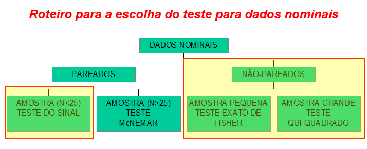

---

### O teste do sinal (The Sign Test):

1) Deseja-se escolher entre dois equipamentos de laboratórios, $A$ e $B$, capazes de realizar $12$ análises diferentes e que a rapidez de execução seja um ponto a ser considerado.

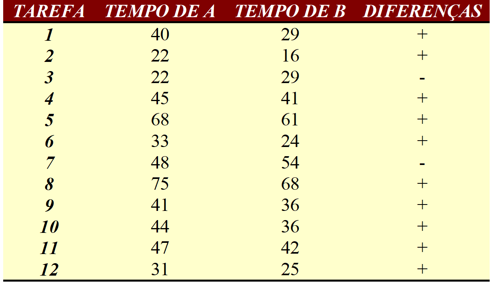

---
### O teste do sinal (The Sign Test):

$$\begin{cases}
H_0: \text{as populações para os grupos são a mesma} \\
H_1: \text{as observações para os grupo não são as mesmas}
\end{cases}$$

sob $H_0$ verdadeira  é de se esperar uma ocorrência de $N/2$ sinais negativos e $N/2$ sinais positivos, ou seja, o problema se resume em testar se $f( - )$ ou $f( + )$ seja igual a $1/2$. assim calcula-se a estatística $Z$ definida por:

$$
Z = \frac{p-0,5}{\sqrt{\frac{N}{2}}} \sim \mathcal{N}(0, 1)
$$

Temos :
 $p = f( - ) = 2/12=1/6$ e   $zc = -2,28$, sendo que o valor crítico de $|Z_{0,05}| =1,96$. Logo pode-se afirmar, com base nos dados amostrais, que os equipamentos $A$ e $B$ diferem entre si significativamente quanto ao tempo do resultado para $\alpha = 0,05$.

---

### Resolvendo no R

$$\begin{cases}
H_0: \text{as populações para os grupos são a mesma} \\
H_1: \text{as observações para os grupo não são as mesmas}
\end{cases}$$

```{r}
A<-c(40,22,22,45,68,33,48,75,41,44,47,31)
B<-c(29,16,29,41,61,24,54,68,36,36,42,25)
D<-A-B
x<-sum(D<0)
N<-length(D)
prop.test(x,N,p=.5,alternative="t")
```
---

2) Em determinada variedade de cana-de-açúcar, o comprimento médio do terceiro internódio é de $22\;cm$. Admitindo esse como um fator discriminante e querendo averiguar se a cada de um talhão pertence a esta variedade, foram tomadas nove amostras de $6$ colmos cada, obtendo-se os seguintes comprimentos médios do terceiro internódio:

$$\begin{cases}
H_0: \mu = 22 \;cm \\
H_1: \mu \neq 22 \;cm
\end{cases}$$

```{r echo=FALSE,fig.align='center',out.width = "400px"}
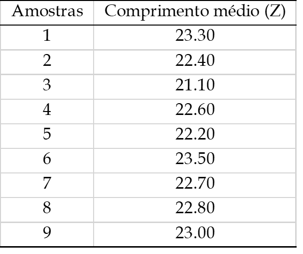
```

---

```{r echo=FALSE,fig.align='center',out.width = "700px"}
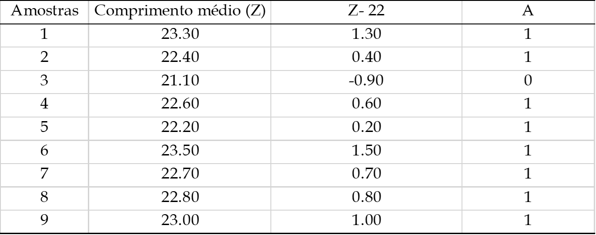
```

---

### Resolvendo no R

```{r}
Z<-c(23.30, 22.40, 21.10, 22.60, 22.20, 23.50, 22.70, 22.80, 23.00)
D<-Z-22
x<-sum(D<0)
N<-length(D)
prop.test(x, N, p=.5, alternative="t")
```

---

### Dados ordinais 

Os dados ordinais raramente têm uma distribuição normal, então para analisa-los, são usados testes não-paramétricos. Os testes de  significância mais comumente aplicados em dados ordinais são os seguintes:

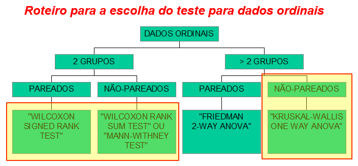

---

#### O teste de "Wilcoxon Signed-Rank" para locação

As vezes desejamos testar uma H0 sobre a média populacional, mas por alguma razão **(amostras pequenas,  n<30, de uma população que sabidamente não tem distribuição normal, e o Teorema do Limite Central não é aplicável)**  nem a estatística $\mathcal{Z}$ ou a  $t-student$ são testes estatísticos apropriados.

Como vimos anteriormente, **o teste do sinal** pode ser usado quando dados consistem de uma amostra simples ou quando temos dados pareados. Entretanto, o Teste do Sinal (The Sign Test) pode não ser adequado visto que **ele não utiliza toda a informação contida nos dados**. Um procedimento mais apropriado pode ser o teste de **Wilcoxon signed-rank** (Teste das Ordens Assinaladas), o qual **faz uso da magnitude da diferença entre as medidas** e parâmetro de locação do que simplesmente os sinais das diferenças. 


O teste de **Wilcoxon** para locação é baseado nas seguintes hipóteses sobre os dados:


  + a amostra é aleatória  
  + a variável é contínua  
  + a população é simetricamente distribuída em torno da sua média    

---

**As hipóteses estatísticas**  

$$a) \begin{cases}
H_0: \mu = \mu_0  \\
H_1: \mu \neq \mu_0
\end{cases}$$

$$b) \begin{cases}
H_0: \mu \ge \mu_0  \\
H_1: \mu < \mu_0
\end{cases}$$

$$c) \begin{cases}
H_0: \mu \le \mu_0  \\
H_1: \mu > \mu_0
\end{cases}$$

Os cálculos do  teste será ilustrado por meio de um exemplo

---

Exemplo: Os dados abaixo referem-se a frequência cardíaca pós operatória de 15 animais operados do coração. Os resultados foram:

Podemos concluir, com base nestes dados de que a média populacional é diferente de $5,05$ ?

$$\begin{cases}
H_0: \mu = 5,05  \\
H_1: \mu \neq 5,05
\end{cases}$$


```{r echo=FALSE,fig.align='center',out.width = "500px"}
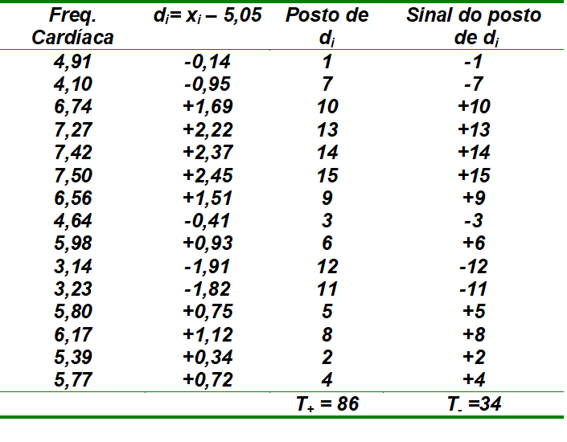
```


Neste exemplo comparamos $T = 34$ com um valor tabelado de $T_t$ . Se $T \le T_{( n, \alpha/2)}$


---
### Resolvendo no R

```{r}
fc<-c(4.91, 4.10, 6.74, 7.27, 7.42, 7.50, 6.56,
	4.64, 5.98, 3.14, 3.23, 5.80, 6.17, 5.39, 5.77)
di<-fc-5.05
posto<-rank(abs(di))
sinal<-ifelse(di>0,posto,-1*posto)
df<-data.frame(fc, di, posto, sinal)
sum(posto[di>0])
sum(posto[di<0])
```

---
```{r}
hist(fc,col="gray",ylim=c(0,5));box()
abline(v=mean(fc),col=2,lwd=2,lty=2)
abline(v=median(fc),col=4,lwd=2,lty=2)
legend(3.5,4,c("Media","Mediana"),col=c(2,4),lty=c(2,2),lwd=2)
```

---

```{r}
wilcox.test(fc,mu=5.05,alternative="t")
```

Não rejeitamos a hipótese da nulidade e podemos concluir que a média populacional não é diferente de $5,05$.

---

#### Teste da Soma dos Postos de Wilcoxon (The Wilcoxon Rank Sum Test).

O teste da soma dos postos de **Wilcoxon** é o teste não paramétrico para comparar dois grupos independentes. 

Ele é um teste não paramétrico análogo **ao teste t** para duas amostras e as vezes é referido como o **Mann-Whitney U test**. 

A hipótese $H_0$ é que as populações são as mesmas. 

A única **suposição** para estes testes é que as observações são independentes. 

Na prática, este teste é usado com variáveis cujas medidas são ordinais, intervalos, e razões. 

As hipóteses necessárias para a aplicação do teste

  + as duas amostras de tamanhos n e m são amostras independentes e aleatórias de suas respectivas populações   
  + a escala das medidas é pelo menos ordinal  
  + se as populações diferem, elas diferem somente com respeito às suas medianas.  

---

Exemplo de aplicação do **Wilcoxon Rank Sum Test** (alternativa mais comumente usada para o teste t para amostras independentes).

Considere os resultados de dois tratamentos A e B, respectivamente, e obteve-se os resultados expressos abaixo.

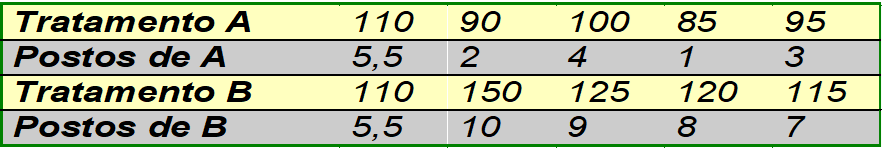
Hipóteses estatísticas

$$\begin{cases}
H_0: \tilde{m}_A = \tilde{m}_B  \\
H_1: \tilde{m}_A \neq \tilde{m}_B
\end{cases}$$

O teste estatístico

$$T = S - \frac{n(n+1)}{2}$$

---

Soma-se os postos dos tratamento A:

Tratamento $A = ( 5,5 + 2 + 4 + 1 + 3 ) = 15,5  =  S$. Então, o valor da estatística é 

$$T = 15,5 - \frac{5(6+1)}{2} = 0,5$$

a qual é menor do que o valor tabelado de $T = 5$ dado em tabela teórica. Portanto concluímos que a **mediana** dos valores dos dados do tratamento A diferem significativamente do tratamento B.

Quando $n > 20$, podemos fazer a aproximação à normal padronizada 

$$z = \frac{T - \frac{nm}{2}}{\sqrt{nm(n+m+1)/12}} \sim \mathcal{N}(0,1)$$

---

### Resolvendo no R

```{r}
y <- c(110,90,100,85,95,110,150,125,120,115)
trat <- gl(2,5,labels=c("A","B"))
wilcox.test(y~trat,alternative="t")
```
---

Utilize o teste de **Wilcoxon Rank Sum** para analisar os dados do conteúdo dos valores do teor de um micronutriente de dois tratamentos A e B.

Hipóteses estatísticas

$$\begin{cases}
H_0: \tilde{m}_A = \tilde{m}_B  \\
H_1: \tilde{m}_A \neq \tilde{m}_B
\end{cases}$$


```{r echo=FALSE,fig.align='center',out.width = "500px"}
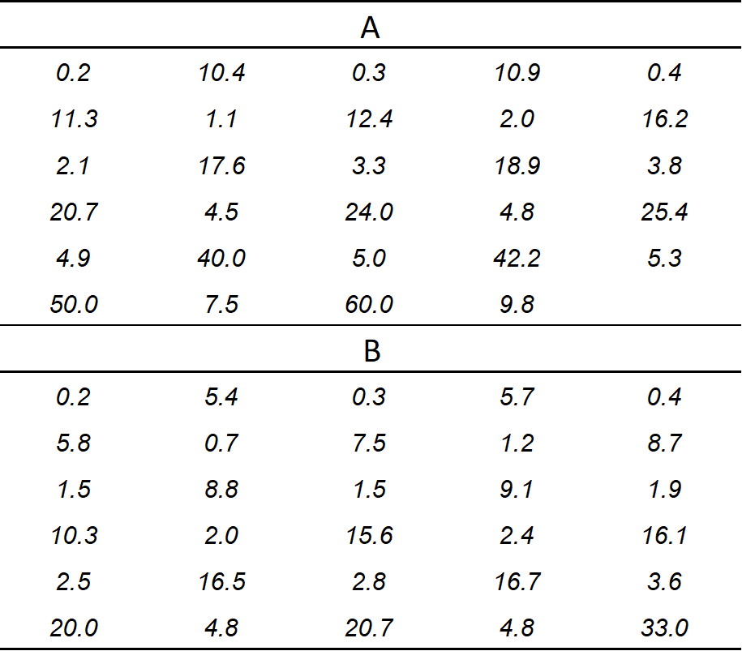
```

---

```{r}
A <- c(
  0.2, 10.4, 0.3, 10.9, 0.4,11.3, 1.1, 12.4, 2.0, 16.2,
  2.1, 17.6, 3.3, 18.9, 3.8,20.7, 4.5, 24.0, 4.8, 25.4,
  4.9, 40.0, 5.0, 42.2, 5.3,50.0, 7.5, 60.0, 9.8
)

B <- c(
  0.2, 5.4, 0.3, 5.7, 0.4,5.8, 0.7, 7.5, 1.2, 8.7,
  1.5, 8.8, 1.5, 9.1, 1.9,10.3, 2.0, 15.6, 2.4, 16.1,
  2.5, 16.5, 2.8, 16.7, 3.6,20.0, 4.8, 20.7, 4.8, 33.0
)
```


---

```{r}
wilcox.test(A,B)
```

---

Exemplo de aplicação do teste de **Wilcoxon signed rank test/Mann-Whitney (aproximação normal)**: sementes foram tratadas com um hormônio. O objetivo do experimento foi determinar se o tratamento com o hormônio A poderia resultar em uma alta taxa de germinação. Os dados observados foram 

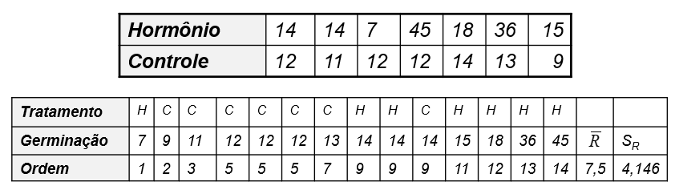

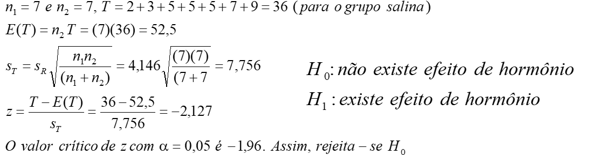

---

### (The Kruskal-Wallis One Way Analysis of Variance by Ranks)

A análise de variância pode ser usada para testar a igualdade de várias médias.

Quando as hipóteses da análise de variância não são satisfeitas, ou seja, **quando as populações** das quais as amostras foram retiradas **não são normais com variâncias iguais**, uma alternativa não-paramétrica para a análise de variância pode ser usada para testar a igualdade de médias.

Várias técnicas não-paramétricas análogas à análise de variância são descritas na literatura, mas a mais bem conhecida é a de **Kruskal-Wallis**.

A técnica será apresentada por meio de um exemplo

---

Suposições: 

  + As doses são amostras aleatórias independentes.  
  + A escala das medidas empregada é pelo menos ordinal.  
  + As distribuições das populações amostradas são idênticas exceto que uma ou mais das populações são compostas de valores que tendem a ser maiores do que nas outras populações.

Hipóteses estatísticas

$$\begin{cases}
H_0: \text{as distribuições das populações são iguais} \\
H_1: \text{pelo menos uma tende a exibir valores maiores do que pelo menos uma outra população.}
\end{cases}$$

---

**Exemplo**: O efeito de três doses de um fungicida no número de lagartas na cultura de soja produziram os dados abaixo. A Dose $I$ serviu como controle, enquanto as plantas nas doses $II$ e $III$ foram tratados são doses crescentes do fungicida. 

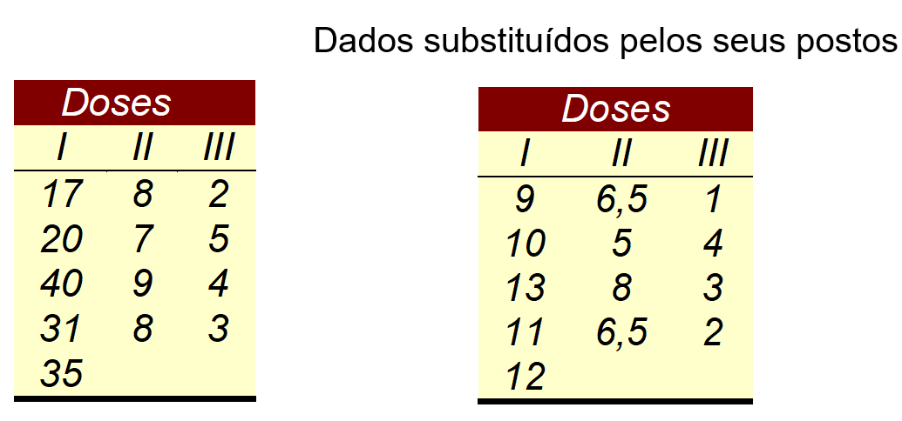
---

### Resolvendo no R

```{r}
g1 <- c(17,20,40,31,35)
g2 <- c(8,7,9,8) 
g3 <- c(2,5,4,3)
```

---

```{r}
boxplot(g1,col=2,ylim=c(0,40),main="g1",cex.lab=2)
```

---

```{r}
boxplot(g2,col=3,ylim=c(0,40),main="g2",cex.lab=2)
```

---

```{r}
boxplot(g3,col=4,ylim=c(0,40),main="g3",cex.lab=2)
```

---

**O teste estatístico**

$$H = \frac{12}{n(n+1)}\sum_{j=1}^k \frac{R^2_j}{n_j}-3(n+1)$$
em que:
$k$ é o número de grupos, $n_j$ é o número de observações no j-ésimo grupo, $n$ é o número total de observações de todos os grupos e $R_j$ é a soma de postos no j-ésimo grupo.

Aplicando aos dados temos

$$H = \frac{12}{13(13+1)}\left( \frac{55^2}{5} + \frac{26^2}{4} + \frac{10^2}{4} \right)-3(13+1) = 10,68$$
Um valor de tabela quando os $nj’s$ são $5$, $4$, e $4$ mostra que o "p-value" alcançado é de $0,005$. Portanto, concluímos que existe uma diferença significativa entre as doses de fungicidas quanto ao número de lagartas na cultura da soja. Para este teste $p < 0,005$.

---

```{r}
kruskal.test(list(g1,g2,g3))
```

---

Para a comparação múltipla, podemos utilizar a função `kruskal` do pacote `agricolae`.

```{r}
resp <- c(g1,g2,g3)
trat <- rep(1:3,c(5,4,4))
agricolae::kruskal(resp,trat, console = TRUE)
```

---
```{r, echo=FALSE}
krsk <- agricolae::kruskal(resp,trat)
krsk$means
krsk$groups
```

---

### Inferências sobre uma ou duas populações: dados categóricos.

Dados categóricos são medidas de variáveis nominais. Pelo fato de que os valores assumidos pelas variáveis nominais não têm interpretações quantitativas, dados categóricos são melhores descritos usando-se contagens e proporções. 

Em muitas situações os dados são coletados simultaneamente para duas variáveis, e deseja-se testar a hipótese de que as frequências de ocorrências de várias categorias de uma variável são independentes das frequências na segunda variável (Teste de Independência). 

---

**Exemplo**: os dados da tabela abaixo são as frequências de observações de cada uma das $4$ cores de cabelo e cada um dos sexos. Neste exemplo uma amostra de $300$ indivíduos foi analisada para estudar se  a cor do cabelo é esta relacionada com o sexo (Teste de Independência).

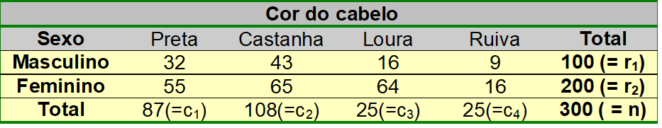

Dizemos que os dados estão arranjados em uma tabela de contingência  2 x 4, ou seja, 2 linhas e 4 colunas 
( r = 2 e c = 4)

Uma tabela com r linhas e c colunas é denominada de  tabela de contingência   $r \times c$

A hipótese de nulidade para as tabelas de contingência é que as **frequências das observações encontradas nas linhas são independentes das frequências das observações encontradas nas colunas** (ou, que as frequências das colunas são independentes das frequências das linhas). 

$$\begin{cases}
H_0: \text{a cor do cabelo humano é independente do sexo na população amostrada} \\
H_1: \text{a cor do cabelo humano não é independente do sexo na população amostrada}
\end{cases}$$

---

### Análise Qui-Quadrado para tabelas de contigência.

O procedimento mais comum para se analisar dados de tabelas de contingências é a estatística Qui-quadrado $(\chi^2)$.

$$\chi^2 = \sum_{i=1}^r \sum_{j=1}^c\frac{(f_{ij}-\hat{f}_{ij})^2}{\hat{f}_{ij}}$$

em que $f_{ij}$ é a frequência observada na i-ésima e na j-ésima coluna e $\hat{f}_{ij}$ é a frequência esperada na i-ésima linha e na j-ésima coluna sob $H_0$ verdadeira.

---

#### As frequências esperadas

Para testar $H_0$, comparamos a frequência observada com frequência esperada, a frequência que esperamos se $H_0$ é verdadeira.

Em uma tabela de contigência  r x c a frequência esperada quando $H_0$ é verdadeira é dada por 

$$\hat{f}_{ij}=\frac{f_{i+} \times f_{+j}}{n}$$

ou seja, total da linha i $(f_{i+})$  x total da coluna j $(f_{+j})$ dividido pelo total da amostra $(n)$.

---

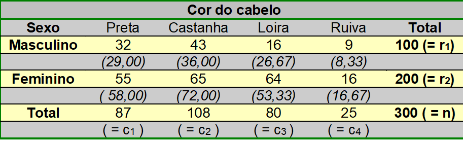

$$\hat{f}_{11} = \frac{87 \times 100}{300} = 29 \cdots \hat{f}_{24} = \frac{25 \times 200}{300} = 16,67$$

O valor do teste qui-quadrado é dado por:


$$\chi^2 = \sum_{i=1}^r \sum_{j=1}^c\frac{(f_{ij}-\hat{f}_{ij})^2}{\hat{f}_{ij}} = \frac{(32-29)^2}{29} + \cdots + \frac{(16-16,67)^2}{16,67} = 8,987$$

Os graus de liberdade são dados por: 

$\nu = (r-1)(c-1) = (2-1)(4-1) = 3$

---

Assim o valor tabelado $\chi^2_{(3;\;0,05)} = 7,815$

Portanto rejeita-se $H_0$, $\chi^2_{calc.}  >  \chi^2_{tab.} ( p = 0,029)$. O teste é significativo (p<0,05) "a cor do cabelo humano não é independente do sexo.

```{r}
tab <- matrix(c(32,55,43,65,16,64,9,16),nrow = 2)
tab
```

```{r}
chisq.test(tab)
```

---

Tabela de valores esperados
```{r}
qui_quadrado <- chisq.test(tab)
qui_quadrado$expected
```

---

### Teste de Homogeneidade

Se as colunas ou as linhas de uma tabela de contingência representam amostras aleatórias de populações independentes, então a hipótese é tipicamente expressa como comparações de proporções.

Por exemplo, para determinar o possível efeito de um tratamento químico na proporção semente/germinação, $100$ sementes quimicamente tratadas e $150$ não tratadas são analisadas. Os números de sementes que germinaram são apresentados na tabela a seguir. Os dados fornecem fortes evidências de que a proporção de sementes germinadas é diferente para as tratadas e as não tratadas?

Considere $p_1$ e $p_2$ as proporções de sementes tratadas e não tratadas quimicamente, respectivamente. Desejamos testar as hipóteses:

$H_0$ : a proporção de sementes tratadas quimicamente é a mesma da proporção das não tratadas $( H_0: p_1   =  p_2 )$   
$H_1$ : a proporção de sementes tratadas quimicamente não é a mesma da proporção das não tratadas $( H_1: p_1 \neq  p_2 )$.

---

 |Germinadas	|  Não Germinadas	| Total
:--- |:---: | :---: | :---: |
Tratadas	| 84	| 16	| 100  
Não tratadas| 	132	| 18| 	150  
Total	| 216	| 34| 	250  


Para analisar esta tabela $2 \times 2$, utilizamos a fórmula

$$\chi^2 = \frac{n(f_{11}f_{22}-f_{12}f_{21})^2}{r_1r_2c_1c_2} = 0,817 \text{ com } p=0,3661$$

Aplicando a correção de Yates para continuidade, a fórmula acima fica.


$$\chi^2 = \frac{n(|f_{11}f_{22}-f_{12}f_{21}|-\frac{n}{2})^2}{r_1r_2c_1c_2}$$

No exemplo fica

$$\chi^2 = \frac{150(|(84)(18)-(16)(132)|-\frac{250}{2})^2}{(100)(150)(216)(34)} = 0,512$$
$$\nu = 1 \text{ e } \chi^2 = 3,841 \text{ com } p = 0,4743$$
Portanto, não se rejeita-se $H_0$. 

---

```{r}
# teste qui-quadrado
tab2 <- matrix(c(84,16,132,18),nrow=2)
chisq.test(tab2,correct=F)    # em correção de Yates
chisq.test(tab2,correct=T)    # com correção de Yates
```

---

```{r}
fisher.test(tab2)   # teste exato de fisher
```

---

**Exemplo**:  Em uma amostra de $50$ ratos, todos da mesma espécie, foram separados em dois grupos de $25$. Os membros de um dos grupos foram alimentados com uma substância que pode ter um efeito na ocorrência de parasitas intestinal, e o segundo grupo não recebeu a alimentação com a substância.   

$H_0$ :  a incidência de infeção de parasita em ratos é a mesma no grupo tratado ou não.  
$H_1$ : a incidência de infeção de parasita em ratos não é a mesma no grupo tratado ou não  

  |Sem a subs.	|  Com a subs.	| Total
:--- |:---: | :---: | :---: |
Com parasita	| 15	| 9	| 24  
Sem parasita | 	10	| 16| 	26  
Total	| 25	| 25| 	50  

---

Aplicando a fórmula com a correção de continuidade de Yates, temos

$$\chi^2 = \frac{50(|(15)(16)-(9)(10)|-\frac{50}{2})^2}{(25)(25)(24)(26)} = 2,003$$

$$\nu = 1 \text{ e } \chi^2_{(1;\;0,05)} = 3,841$$
Portanto, não rejeita-se $H_0$, com valor de $p =0,16$ 

---

#### Resolvendo no R

```{r}
# teste qui-quadrado
tab2 <- matrix(c(15,9,10,16),nrow=2)
qchisq(p = 1-0.05,1) # quantil para 0.95
```


```{r}
chisq.test(tab2,correct=F)    
chisq.test(tab2,correct=T)
```

---

```{r}
fisher.test(tab2)   
```

---

### Contagens requeridas para o teste Qui-quadrado

Podemos usar o teste qui-quadrado com segurança quando não mais que de $20\%$  de contagens esperadas são menores que $5$ e todas as contagens esperadas individuais são iguais a, ou superiores a $1$. Em particular, todas as quatros contagens esperadas em uma tabela $2 \times 2$ devem ser iguais ou superiores a $5$.

Nestes casos o teste Exato de Fisher *(Fisher´s exact test)* é geralmente preferível ao teste Qui-Quadrado, especialmente quando as frequências são pequenas. (dados muito esparsos)  

---

Exemplo: Habilidade de cobras de se fixar

 |resistiram	|  não resistiram	| Total
:--- |:---: | :---: | :---: |
espécie 1	| 12	| 7	| 19  
espécie 2 | 	2	| 9| 	11  
Total	| 14	| 16| 	30  

$H_0:$ a habilidade das cobras de resistir a correte não é diferente nas duas espécies.  
$H_1:$ a habilidade das cobras de resistir a correte é diferente nas duas espécies.

$$\chi^2 = \frac{20(|(12)(9)-(2)(7)|-\frac{20}{2})^2}{(14)(16)(19)(11)} = 3,999$$

$$\nu = 1 \text{ e } \chi^2_{(1;\;0,05)} = 3,841$$


Portanto, não rejeitamos $H_0$.

---

```{r}
#teste exato de Fisher
tab3 <- matrix(c(12,2,7,9),nrow=2)
tab3
chisq.test(tab3,correct=T) 
fisher.test(tab3)
```

---

### Restrições do uso do teste $\chi^2$

Por razões teóricas:
  + os testes vistos aplicam-se sem restrição se todas as fe’s  são maiores do que 5;

  + nas tabelas de contingência com mais de $1$ grau de liberdade, se poucas fe’s são menores do que $5$ (20% ou menos das células), pode-se aplicar o teste $\chi^2$, desde que  as fe’s sejam maiores ou iguais 1. Se estas condições não se verificam, pode-se juntar categorias adjacentes de modo a aumentar as fe’s;

- os testes somente devem ser aplicados aos dados observados e nunca com as proporções ou porcentagens oriundas dos mesmos. 


